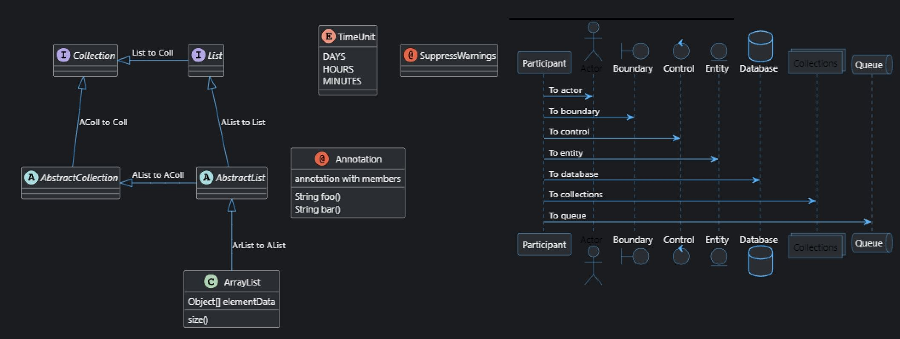
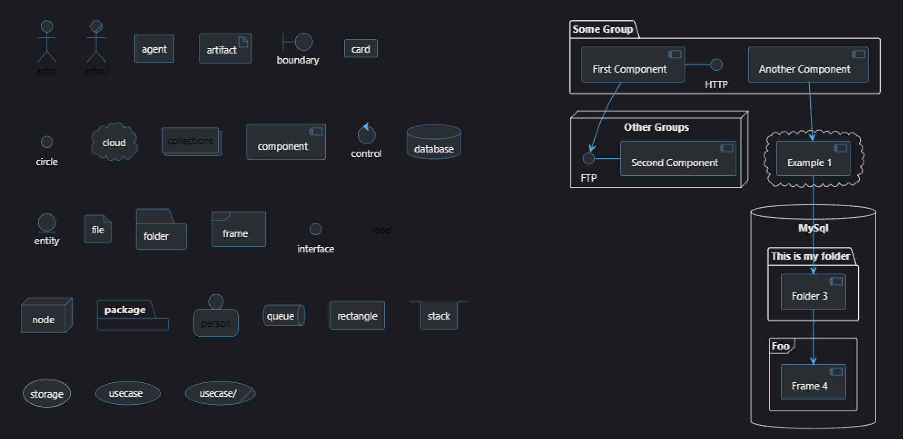

# [One Dark Contrast](https://github.com/brunofrancoucu/plantuml-dark-contrast-theme) [PlantUML](https://plantuml.com) theme

Forked from [One Dark](https://github.com/atom/atom/tree/v1.53.0/packages/one-dark-ui)

## Screenshots

<!-- JetBrains:

 -->

Visual Studio Code:

<!--  -->



## Usage

[`!include`](https://plantuml.com/preprocessing#393335a6fd28a804) the theme file:

```puml
@startuml

!include https://raw.githubusercontent.com/brunofrancoucu/plantuml-dark-contrast-theme/main/theme.puml

Bob->Alice : hello

@enduml
```
